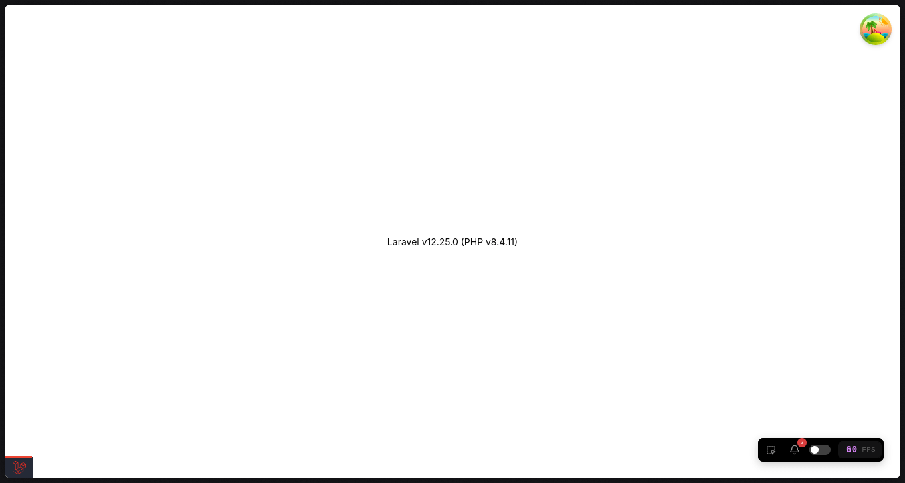

[](https://github.com/SantosVilanculos/inertia-template/actions)
[](https://packagist.org/packages/santosvilanculos/inertia-template)
[](https://packagist.org/packages/santosvilanculos/inertia-template)
[](https://github.com/SantosVilanculos/inertia-template/blob/main/LICENSE)



The skeleton application for the [Laravel framework](https://laravel.com/) and [Inertia](https://inertiajs.com/).

```sh
laravel new --using=santosvilanculos/inertia-template
```
